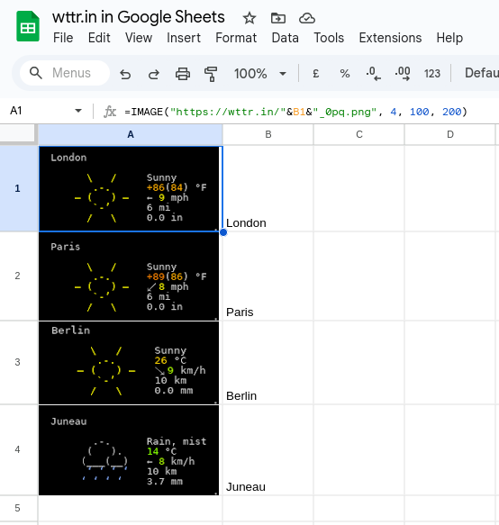

## Integrations

Thanks to the ease of integrating *wttr.in* into any program, there are a
plethora of popular integrations across various libraries, programming
languages, and systems.

*wttr.in* is compatible with:

* terminal managers,
* window managers,
* editors,
* chat clients,

and more, these integrations enhance workflow efficiency by embedding weather information directly into user interfaces.

Below, we've compiled a list of some of these integrations. While not
exhaustive, it serves as a guide to help you use *wttr.in* within your favorite
application or add integration to a new one.


| Integration For                | Short Description                                                                                                | Repository                                                                                         |
|--------------------------------|------------------------------------------------------------------------------------------------------------------|----------------------------------------------------------------------------------------------------|
| **Terminal Managers**          |                                                                                                                  |                                                                                                    |
| [tmux](#tmux)                  | Allows embedding weather data in the tmux status bar with customizable update intervals.                         | -                                                                                                  |
| **Window Managers Statusbars** |                                                                                                                  |                                                                                                    |
| [Waybar](#Waybar)              | A custom module in Rust for displaying weather in Waybar, with support for custom indicators and error handling. | [wttrbar](https://github.com/bjesus/wttrbar)                                                       |
| [Xmobar](#Xmobar)              | A Python script for integrating weather data into Xmobar.                                                        | [weather-xmobar-wttr.in](https://github.com/alexeygumirov/weather-xmobar-wttr.in)                  |
| [AwesomeWM](#AwesomeWM)        | Displays weather in AwesomeWM with a focus on clean UI and tooltips.                                             | [wttr-widget](https://github.com/pivaldi/wttr-widget)                                              |
| **Editors**                    |                                                                                                                  |                                                                                                    |
| [Emacs](#Emacs)                | An Emacs frontend for showing weather forecasts directly within Emacs.                                           | [emacs-wttrin](https://github.com/bcbcarl/emacs-wttrin)                                            |
| [Emacs](#Emacs)                | Displays weather in the Emacs mode line with emoji support, configurable for updates.                            | [display-wttr](https://git.sr.ht/~josegpt/display-wttr)                                            |
| **Chats**                      |                                                                                                                  |                                                                                                    |
| [Conky](#Conky)                | Example script for displaying weather in Conky using transparent images.                                         | -                                                                                                  |
| [WeeChat](#WeeChat)            | Script for embedding weather in the WeeChat IRC client's status bar.                                             | -                                                                                                  |
| [IRC](#IRC)                    | Uses Qt-based mirc bot to show weather updates.                                                                  | [IRC integration](https://github.com/OpenSourceTreasure/Mirc-ASCII-weather-translate-pixel-editor) |
| **Other**                      |                                                                                                                  |                                                                                                    |
| [ObsidianMD](#ObsidianMD)      | Script for embedding weather in Squeak's world main docking bar.                                                 | -                                                                                                  |
| [RainMeter](#Rainmeter)        |                                                                                                                  | -                                                                                                  |
| [Squeak](#Squeak)              |                                                                                                                  | -                                                                                                  |
| [Twitch](#Twitch)              |                                                                                                                  | -                                                                                                  |

## Terminal Managers

### tmux

When using in `tmux.conf`, you have to escape `%` with `%`, i.e. write there `%%` instead of `%`.

The output does not contain new line by default, when the %-notation is used, but it does contain it when preconfigured format (`1`,`2`,`3` etc.)
are used. To have the new line in the output when the %-notation is used, use '\n' and single quotes when doing a query from the shell.

In programs, that are querying the service automatically (such as tmux), it is better to use some reasonable update interval. In tmux, you can configure it with `status-interval`.

If several, `:` separated locations, are specified in the query, specify update period
as an additional query parameter `period=`:

```
set -g status-interval 60
WEATHER='#(curl -s wttr.in/London:Stockholm:Moscow\?format\="%%l:+%%c%%20%%t%%60%%w&period=60")'
set -g status-right "$WEATHER ..."
```


## Window Managers Statusbars

### Waybar

[wttrbar](https://github.com/bjesus/wttrbar) by *bjesus*

A custom module for displaying weather in Waybar using wttr.in. It’s written in
Rust for reliability and supports features like custom indicators (e.g.,
temperature in Celsius or Fahrenheit), location specification, and date
formatting.

Example configuration:

```json
    "custom/weather": {
      "format": "{}°",
      "tooltip": true,
      "interval": 3600,
      "exec": "wttrbar --location=Paris --main-indicator=FeelsLikeC --date-format=%d.%m.%Y",
      "return-type": "json"
    }
```

Installation:

Compile using cargo build --release or download pre-built binaries. Requires a font supporting emojis (e.g., Noto Emoji) for weather icons.

Features: Supports custom styling based on weather conditions (e.g., sunny), handles wttr.in errors gracefully, and allows wind direction display with Unicode arrows.


### Xmobar

[weather-xmobar-wttr.in](https://github.com/alexeygumirov/weather-xmobar-wttr.in) by *alexeygumirov*

A Python-based script for displaying weather status in Xmobar, leveraging
wttr.in. It provides a lightweight solution for integrating weather data into
the Xmobar status bar.


(displays weather conditions in a compact format suitable for Xmobar).

### AwesomeWM

[wttr-widget](https://github.com/pivaldi/wttr-widget) by *pivaldi*

A weather widget for AwesomeWM that uses wttr.in to display weather information. It’s designed to integrate seamlessly with the Awesome window manager, providing a tooltip with detailed weather data.

Displays weather conditions with a focus on a clean, customizable UI. The screenshot shows a tooltip with weather details like temperature and conditions.


(shows a tooltip with weather data integrated into AwesomeWM)

## Editors

### Emacs

#### emacs-wttrin by bcbcarl

[emacs-wttrin](https://github.com/bcbcarl/emacs-wttrin) by *bcbcarl*

An Emacs frontend for wttr.in, allowing users to view weather forecasts directly within Emacs. It’s designed for simplicity and integration into the Emacs workflow.

Users can configure it to fetch weather for specific locations and display it in a buffer.

#### display-wttr by josegpt

[display-wttr](https://git.sr.ht/~josegpt/display-wttr) by *josegpt*
    
Displays wttr.in weather data in the Emacs mode line with emoji support (requires Emacs 28 or later). It’s lightweight and configurable for periodic updates.

Configuration Example:

```elisp
(use-package display-wttr
  :config
  (display-wttr-mode))
```

Supports custom locations, update intervals, and emoji-based weather display. The repository has moved to https://git.sr.ht/~josegpt/display-wttr.

Screenshot: 


(shows weather with emojis in the Emacs mode line).

## Chats

### conky

Conky usage example:

```
${texeci 1800 curl wttr.in/kyiv_0pq_lang=uk.png
  | convert - -transparent black $HOME/.config/conky/out.png}
${image $HOME/.config/conky/out.png -p 0,0}
```


### WeeChat

To embed in to an IRC ([WeeChat](https://github.com/weechat/weechat)) client's existing status bar:

```
/alias add wttr /exec -pipe "/mute /set plugins.var.wttr" url:wttr.in/Montreal?format=%l:+%c+%f+%h+%p+%P+%m+%w+%S+%s;/wait 3 /item refresh wttr
/trigger add wttr timer 60000;0;0 "" "" "/wttr"
/item add wttr "" "${plugins.var.wttr}"
/eval /set weechat.bar.status.items ${weechat.bar.status.items},spacer,wttr
/eval /set weechat.startup.command_after_plugins ${weechat.startup.command_after_plugins};/wttr
/wttr
```


### IRC

[IRC integration](https://github.com/OpenSourceTreasure/Mirc-ASCII-weather-translate-pixel-editor)


## Other

### ObsidianMD Integration

A script for ObsidianMD (a note-taking app) integrates wttr.in to embed weather data in daily notes using the Templater plugin. It fetches and displays weather details for a specified location only for the current day’s note.

*Usage:* Add a script to the Templater plugin to check if the note’s date matches today and fetch weather data. Example script:

```javascript
<%* if (tp.file.title === tp.date.now()) { %>
  <%* const weather = await requestUrl('https://wttr.in/Berlin?format=%l:+%c+%C+%t+feels+like+%f\nTime:+++++%T\nSunrise:++%S\nSunset:+++%s\nMoon:+++++%m\nWind:+++++%w\nRainfall:+%p\nHumidity:+%h') %>
  <%* tR += weather.text %>
<%* } else { %>
  Update the weather report!
<%* } %>
```

This displays weather details like temperature, sunrise/sunset, moon phase, wind, rainfall, and humidity in the note body.

*Features:* Updates only for the current day’s note, supports custom formats, and can be triggered manually via a hotkey.


### Rainmeter

Rainmeter, a desktop customization tool for Windows, can use wttr.in to display
weather data by parsing its JSON output. This is particularly useful for
creating custom desktop widgets.

Use a URL like `https://wttr.in/Alexandria,Virginia?format=j1` to fetch
JSON data, which includes detailed weather metrics (e.g., temperature,
humidity, wind speed, weather code). A Lua script can map weather codes to
local icons for visualization.

Parses JSON for detailed weather data, supports integration with
custom icons (referencing WorldWeatherOnline’s weather codes), and allows for
flexible widget design.

### Squeak

To embed into the world main docking bar:

```smalltalk
wttr := (UpdatingStringMorph on: [(WebClient httpGet: 'https://wttr.in/?format=%20%20%l:%20%C+%t') content] selector: #value)
	stepTime: 60000;
	useStringFormat;
	yourself.
dockingBar := World mainDockingBars first.
dockingBar addMorph: wttr after: (dockingBar findA: ClockMorph).
```


### Twitch

wttr.in is used to create a custom `!weather` command for Twitch streams, allowing viewers to query weather for a specific location (e.g., `!weather Toronto`).
The command formats wttr.in output for display in chat.

```bash
curl "https://wttr.in/Toronto?format=:+%c+%l+is+currently+%C+with+a+temperature+of+%t+(+%f).+The+wind+is+blowing+from+%w.+The+Humidity+is+currently+%h&u"
```

This outputs, e.g., : ⛅️ Toronto is currently Partly Cloudy with a temperature
of +7°C (+45°F). The wind is blowing from NE. The humidity is currently 65%. To
display Fahrenheit in parentheses, add `?u` to the URL for USCS units.

Features: Customizable output for Twitch chat, supports both Celsius and
Fahrenheit, and handles location-based queries dynamically.

Details: [wttr.in-on-twitch](https://www.reddit.com/r/commandline/comments/1eqoa0w/creating_a_weather_command_using_wttrin_service/)


### Google Sheets / Excel 365

It is possible to show the live weather in Google Sheets.

Assume you want the weather image for a specific location, and the location is either hardcoded or stored in a cell.
Example 1: Hardcoded Location (London):
In a cell (e.g., A1), enter:
excel

```
=IMAGE("https://wttr.in/London_0pq.png", 1)
```

This inserts a weather image for London, resized to fit the cell while maintaining the aspect ratio.
Example 2: Dynamic Location (from a cell):
If cell B1 contains the location (e.g., London), use:

```excel
    =IMAGE("https://wttr.in/"&B1&"_0pq.png", 4, 100, 200)
```

This inserts the image with a custom size (100px height, 200px width). Adjust height and width as needed.

Customize the wttr.in URL (Optional):

* `_0pq`: Simple weather image (current conditions, no background).
* `_m`: Metric units (e.g., Celsius).
* `_u`: USCS units (e.g., Fahrenheit).
* `_t`: Transparent background.

Example with metric units and transparency:

```
=IMAGE("https://wttr.in/"&B1&"_0pqt_m.png", 1)
```


