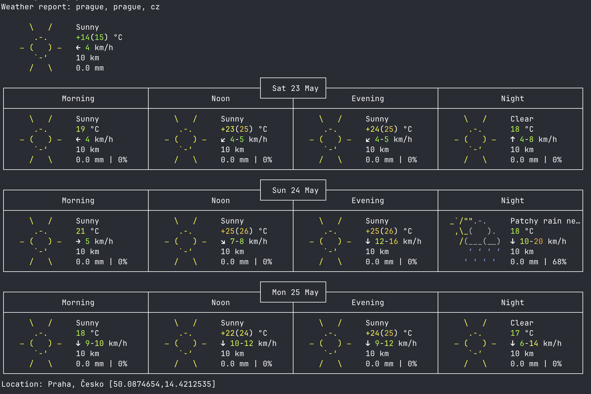
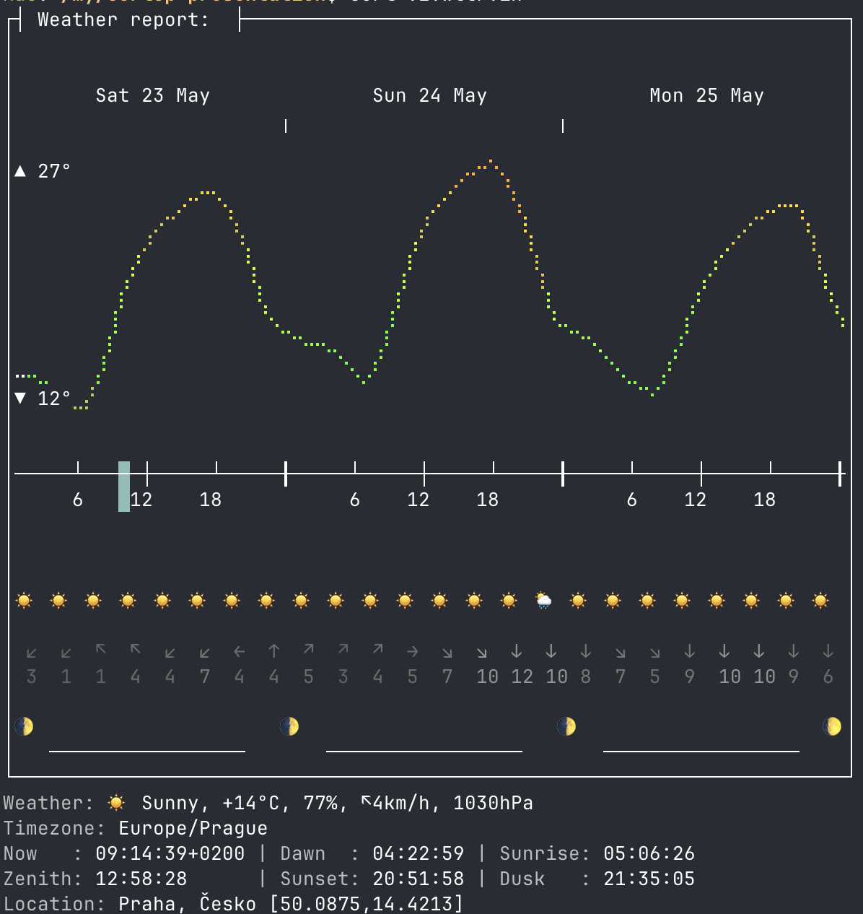
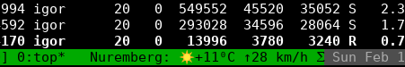
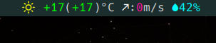
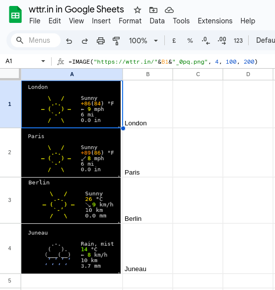
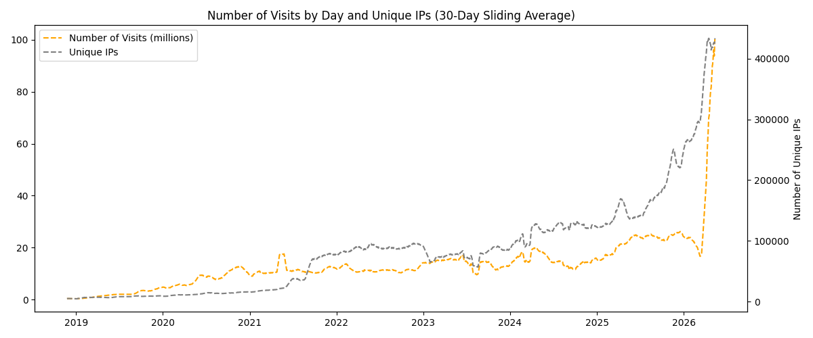

# How it works

## Timeline

**2015–2016** — Started as a small wrapper to demonstrate the idea of console services  
**2017** — Initial growth in popularity  
**2017** — Presented at curl up 2017  
**2018** — Introduction of new features and views (V2, V3, one-line format etc)   
**2019** — curlator framework presented at curl up  
**2020** — Reached 10M+ daily queries   
**2026** — Reached 100M+ daily queries

Some metrics:

* **29.7k** Github Stars
* **74** languages
* **200+** contributors (mostly translators)

## Timeline


## Core Concept

**wttr.in** is a **console-oriented weather forecast service** that returns beautiful, human-readable output directly in your terminal.

```bash
curl wttr.in                    # Auto-detects location by IP
curl wttr.in/London             # Specific city
curl wttr.in/Eiffel+Tower       # Landmarks
curl fr.wttr.in/Paris           # Localized output
```

**Key Features:**

- Automatic terminal capability detection (ANSI colors, width)
- Rich ASCII art icons
- Multiple output formats: ANSI, HTML, PNG

---

## V1 — Standard View




---

## V2 — Rich Data Format

```bash
curl v2.wttr.in/London
```

**New in V2:**

- Detailed hourly forecasts
- Moon phases (today + next 3 days)
- Astronomical data (dawn, sunrise, sunset, dusk)
- Precise coordinates and timezone
- Structured output perfect for scripting

---

## V2 — Rich Data Format



---

## Oneline Mode

Perfect for **status bars, tmux, shell prompts**, and scripts.

```bash
curl wttr.in/?format=1
curl wttr.in/?format=3
curl wttr.in/?format=%t
```

**Example output:**
```
London: +18°C
```

## Where wttr.in is Used

- Shell scripts & dotfiles
- Status bars (i3, sway, tmux, waybar, etc.)
- Linux distributives (Omarchy etc)
- Custom dashboards
- PowerShell & Windows Terminal
- Monitoring tools
- Browser shortcuts (PNG mode)
- Browser extensions

## Where wttr.in is Used (Omarchy Linux uses wttr.in by default)


## Where wttr.in is Used (tmux, AwesomeWM, Xmobar, Emacs)







## Where wttr.in is Used (can be used everywhere)



## LLMs Love wttr.in

Possible weather related queries:

- `how to check weather in linux`
- `... in bash`
- `... in cli`
- `... in shell`
- `... in terminal`

in all major LLMs:

- `GPT-[45]*` from OpenAI
- `Gemini` from Google
- `Grok` from xAI
- `DeepSeek`
- etc


---

## Lists of Agents and wttr.in

These projects commonly use wttr.in as a lightweight weather skill or tool within their agent capabilities:

- openclaw
- QuantClaw
- picobot
- microclaw
- nanobot
- openakita
- devclaw
- openpaw
- debot
- cortez
- rayclaw
- acpclaw
- ...

and many others.

## Hello World for skills

wttr.in is typically used to explain the notion of a skill to the user.

Example from **picobot** README:

```
## Skills System

Teach your agent new tricks. Skills are modular knowledge packages that extend
the agent:

---
You: "Create a skill for checking weather using curl wttr.in"
Agent: Created skill "weather" — I'll use it from now on.
---

Skills are just markdown files in ~/.picobot/workspace/skills/.
Create them via the agent or manually.
```


## Current Traffic



## Current Traffic

- ~100 million queries per day (sliding 30 day average)
- 400,000 – 450,000 unique users daily (sliding 30 day average)
- Up to 800,000 users in the peak days
- Up to 200 million queries in the peak days
- Strong and continuous growth

To put it into perspective:

- curl.se (fastly) serves 118B/year ~ 300M/daily

## LLMs Love wttr.in

**Console-First Design = Agent-Friendly**

It is one of the most **agent-friendly** weather services:

- Zero setup — just a simple `GET` request
- Simple and consistent URL structure
- No API keys required
- Clean, predictable, human-readable output
- No bloat, returns exactly the data needed

This philosophy aligns perfectly with how modern AI coding/terminal agents operate:

- They live in terminals.
- They use curl, wget, or simple HTTP clients.
- They prefer text interfaces over JSON-heavy APIs.


## curlator — Framework for building console-oriented web services

**Philosophy:**
> The web should be friendly to `curl` users.

Converts Linux/CLI/Terminal programs or APIs into console services.

Used by:

- **wttr.in** -- weather service
- **cheat.sh** -- the only cheat sheet you need
- **rate.sx** -- cryptocurrency exchange rates
- others

More services at:

* https://github.com/chubin/ -- my services
* https://github.com/chubin/awesome-console-services -- other console services

## curlt — Terminal Extension for curl

**curlt** is a **drop-in replacement / wrapper** for `curl` that adds rich terminal context to every request.

It enables console services (like wttr.in) to **adapt their output** intelligently to the client’s environment.

### Headers Sent by curlt (`X-Curlt-` prefix)

| Header                      | Description                              | Example                     |
|-----------------------------|------------------------------------------|-----------------------------|
| `X-Curlt-Lang`              | Language / Locale                        | `en_US.UTF-8`               |
| `X-Curlt-Terminal`          | Terminal type & capabilities             | `xterm-256color`            |
| `X-Curlt-Columns`           | Terminal width                           | `120`                       |
| `X-Curlt-Lines`             | Terminal height                          | `38`                        |
| `X-Curlt-Attached`          | Is terminal attached / interactive?      | `true` / `false`            |
| `X-Curlt-Image`             | Preferred Image Protocol                 | `sixel`                     |

```bash
# Direct usage
curlt wttr.in/London
```

---


## Thank You!

```bash
curl wttr.in
```

**Useful Links:**

- GitHub: [github.com/chubin/wttr.in](https://github.com/chubin/wttr.in)
- Alternative domain: `wttr.is`


**Long live curl!**
